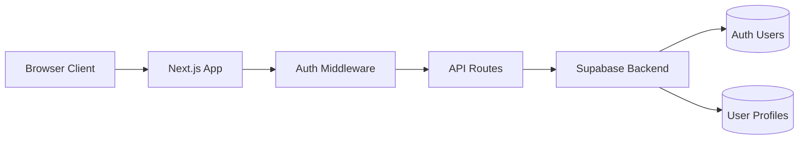
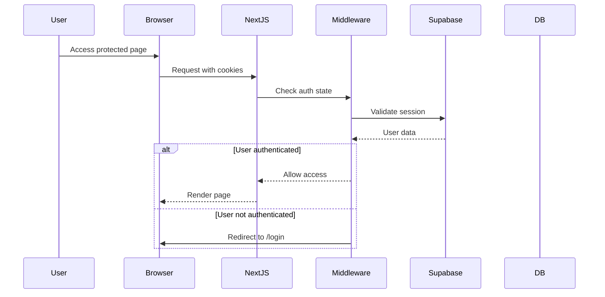
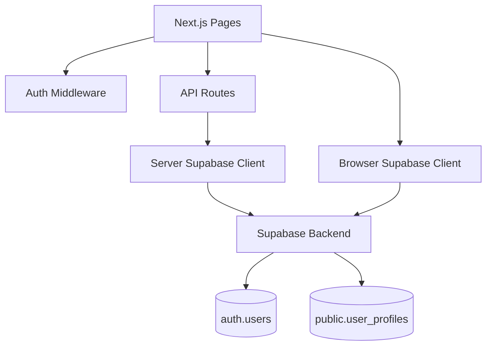
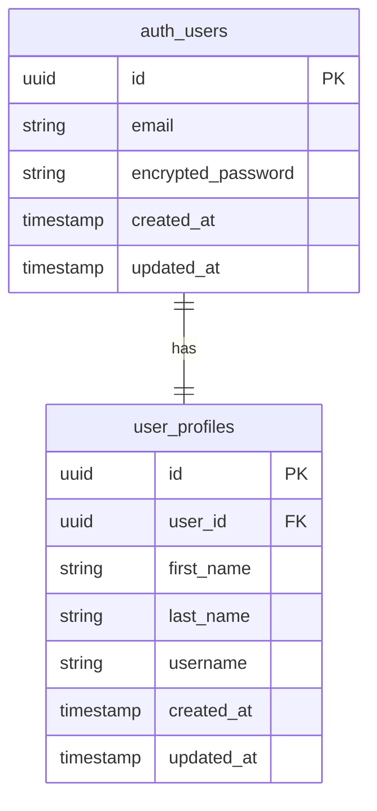
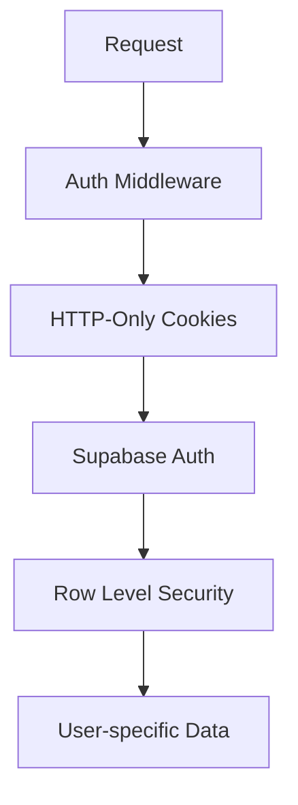
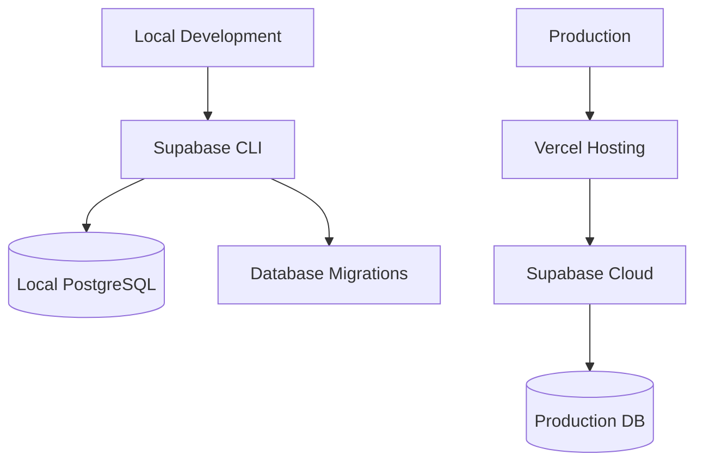

# 🏗️ Architecture: Supabase Auth App

**Status**: 🟢 ACTIVE  
**Last Updated**: 2025-07-03
**Author(s)**: Developer

---

## 📚 Technical Summary

- Full-stack Next.js application with Supabase authentication
- Server-side rendering (SSR) with secure cookie-based session management
- PostgreSQL database with Row Level Security (RLS) for data protection
- RESTful API endpoints for authentication and user profile management
- Local development environment with Supabase CLI for database migrations

---

## 🧰 Technology Stack

| Layer         | Technology         | Purpose              | Version/Notes            |
|---------------|--------------------|-----------------------|---------------------------|
| **Frontend**  | Next.js            | React Framework       | App Router               |
|               | TypeScript         | Type Safety           | Latest                   |
|               | React              | UI Library            | 18+                      |
| **Backend**   | Next.js API Routes | Server-side Logic     | Built-in API             |
|               | Supabase Auth      | Authentication        | SSR with cookies         |
| **Database**  | PostgreSQL         | Relational DB         | via Supabase             |
|               | Supabase           | Backend-as-a-Service  | Auth + DB + RLS          |
| **Dev Tools** | Supabase CLI       | Local Development     | Migrations + Reset       |
| **Packages**  | @supabase/ssr      | SSR Integration       | Cookie management        |
|               | @supabase/supabase-js | Client Library     | Browser + Server         |

---

## 🌐 High-Level System Architecture



---

## 🧩 Core Business Flow: User Authentication



---

## 🧱 Detailed Module Architecture



---

## 🗃️ Data Models



---

## 🔐 Security Architecture



* **Authentication**: Supabase Auth with email/password
* **Session Management**: HTTP-only cookies via @supabase/ssr
* **Authorization**: Row Level Security (RLS) policies
* **Data Protection**: User can only access their own profile data
* **CSRF Protection**: Built-in Next.js CSRF protection

---

## 🚀 Deployment Architecture



### Environments

1. **Development** – Local Supabase instance with CLI
2. **Production** – Supabase Cloud with Vercel hosting

---

## 🔁 Database Migration Strategy

* **Migration Files**: Timestamped SQL files in `supabase/migrations/`
* **Naming Convention**: `YYYYMMDDHHmmss_description.sql`
* **Local Development**: `supabase db reset` applies all migrations
* **Production**: Migrations applied via Supabase Dashboard or CLI

---

## 📈 API Endpoints

### Authentication Routes

| Endpoint | Method | Purpose | Auth Required |
|----------|--------|---------|---------------|
| `/api/auth/signup` | POST | Create user + profile | No |
| `/api/auth/login` | POST | Authenticate user | No |
| `/api/auth/logout` | POST | Sign out user | Yes |
| `/api/auth/user` | GET | Get current user | Yes |

### Request/Response Examples

**POST /api/auth/signup**
```json
{
  "email": "user@example.com",
  "password": "password123",
  "firstName": "John",
  "lastName": "Doe",
  "username": "johndoe"
}
```

**GET /api/auth/user**
```json
{
  "user": {
    "id": "uuid",
    "email": "user@example.com"
  },
  "profile": {
    "first_name": "John",
    "last_name": "Doe",
    "username": "johndoe"
  }
}
```

---

## 📐 Development Guidelines

### Folder Structure

```plaintext
/supabase-auth-app
  ├── app/                    # Next.js App Router
  │   ├── api/auth/          # Authentication API routes
  │   ├── login/             # Login page
  │   └── middleware.ts      # Auth middleware
  ├── lib/
  │   ├── supabase/
  │   │   ├── client.ts      # Browser client
  │   │   └── server.ts      # Server client
  ├── supabase/
  │   └── migrations/        # Database migrations
  └── .env.local            # Environment variables
```

### Critical Implementation Rules

1. **Always use @supabase/ssr** - Never use deprecated auth-helpers
2. **Cookie handling** - Only use `getAll()` and `setAll()` methods
3. **RLS policies** - Enable on all tables, separate policies per operation
4. **Migration naming** - Follow `YYYYMMDDHHmmss_description.sql` format

---

## 🧪 Testing Strategy

### Local Development

```bash
# Start local Supabase
supabase start

# Reset database with migrations
supabase db reset

# Run development server
npm run dev
```

### Database Testing

* Use `supabase db reset` to test migrations
* Verify RLS policies with different user contexts
* Test API endpoints with authenticated/unauthenticated requests

---

## 📌 Key Features

* **Secure Authentication**: Server-side session management with HTTP-only cookies
* **User Profiles**: Extended user data beyond basic auth
* **Database Security**: Row Level Security ensures data isolation
* **Local Development**: Full Supabase stack running locally
* **Type Safety**: TypeScript throughout the application
* **Migration System**: Version-controlled database schema changes

---

## 📌 Appendix

* [Supabase Documentation](https://supabase.com/docs)
* [Next.js App Router](https://nextjs.org/docs/app)
* [Database Migrations Guide](./supabase/migrations/)