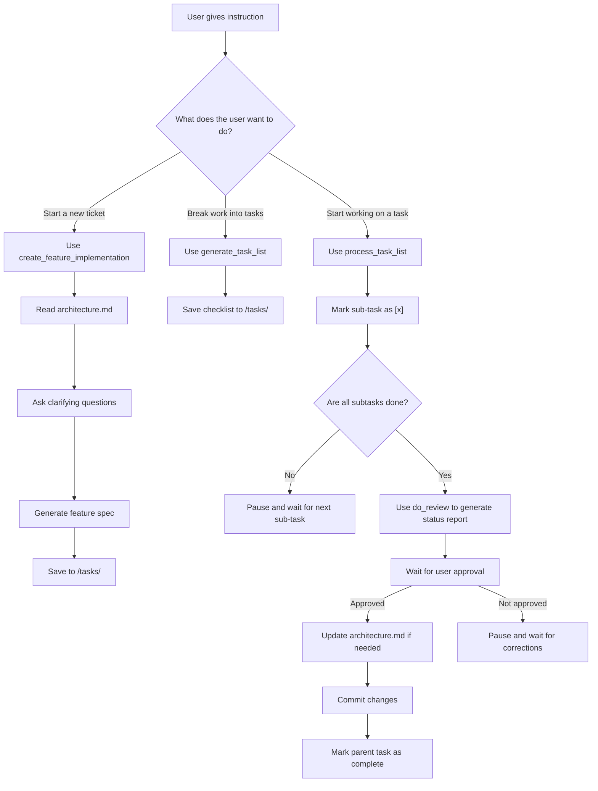

# 🧠 Rule: Development Process Prompt Invocation

This rule show hows to use the correct prompts and architectural file when progressing through the development lifecycle. It defines when and how to invoke prompt files, update architecture, and ensure user review before commits.

---

## 📁 Instruction Paths

| Purpose                        | File Path                                                   |
|-------------------------------|-------------------------------------------------------------|
| Feature Implementation Prompt | `.amazonq/instructions/create_feature_implementation.md`    |
| Task List Generation          | `.amazonq/instructions/generate_task_list.md`               |
| Todo Item Processing          | `.amazonq/instructions/process_task_list.md`                |
| Work Review Prompt            | `.amazonq/instructions/do_review.md`                        |
| Architecture File             | `.amazonq/rules/architecture.md`                            |

---

## 🔁 Process Logic (Mermaid Diagram)

---

## 🧩 Step-by-Step Prompt Rules

### 1. Starting a New Feature Ticket

* Invoke: `.amazonq/instructions/create_feature_implementation.md`
* Steps:

  * Read `.amazonq/rules/architecture.md` for existing system context.
  * Ask user clarifying questions about the feature.
  * Write a **Feature Implementation Specification** in Markdown.
  * Save to `/tasks/[ticket-id]-implementation-specification.md`.

---

### 2. Generating the Task List

* Invoke: `.amazonq/instructions/generate_task_list.md`
* Steps:

  * Create a checklist outlining the implementation tasks.
  * Save to `/tasks/[ticket-id]-todo.md`.

---

### 3. Working on a Task

* Invoke: `.amazonq/instructions/process_task_list.md`
* Rules:

  * Work on only **one sub-task at a time**.
  * After completing it:

    * Mark it as `[x]`.
    * If all subtasks of the parent are `[x]`, **do not commit yet**.
    * Trigger a review step instead.

---

### 4. Review Before Committing

* Invoke: `.amazonq/instructions/do_review.md`
* Steps:

  * Generate a status report in Markdown format with:

    * `## Completed`, `## Remaining`, `## Issues`, `## Divergences`, `## Suggestions`
  * Save to `/tasks/[ticket-id]-status-report.md`
  * Wait for explicit user approval before continuing.

---

### 5. After Review Approval

* If user approves:

  * If architectural changes were made:

    * Update `.amazonq/rules/architecture.md`.
  * Run tests.
  * Clean up temporary code.
  * Stage and commit changes with descriptive messages.
  * Mark parent task as complete.

---

## ⛔ Do Not

* ❌ Do not start the next sub-task without user confirmation.
* ❌ Do not commit any changes until:

  * A review is complete
  * The user has explicitly approved the status report

---

## ✅ Final Note

Always reflect system updates in `.amazonq/rules/architecture.md` to maintain architectural traceability. Cursor should follow this rule for **every ticket or change request** unless explicitly instructed otherwise.

