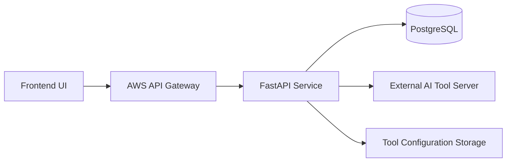
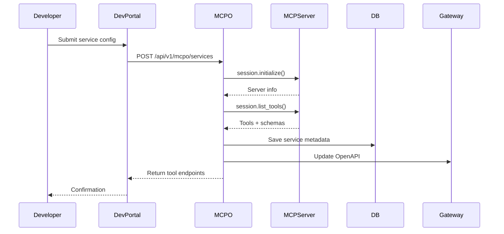
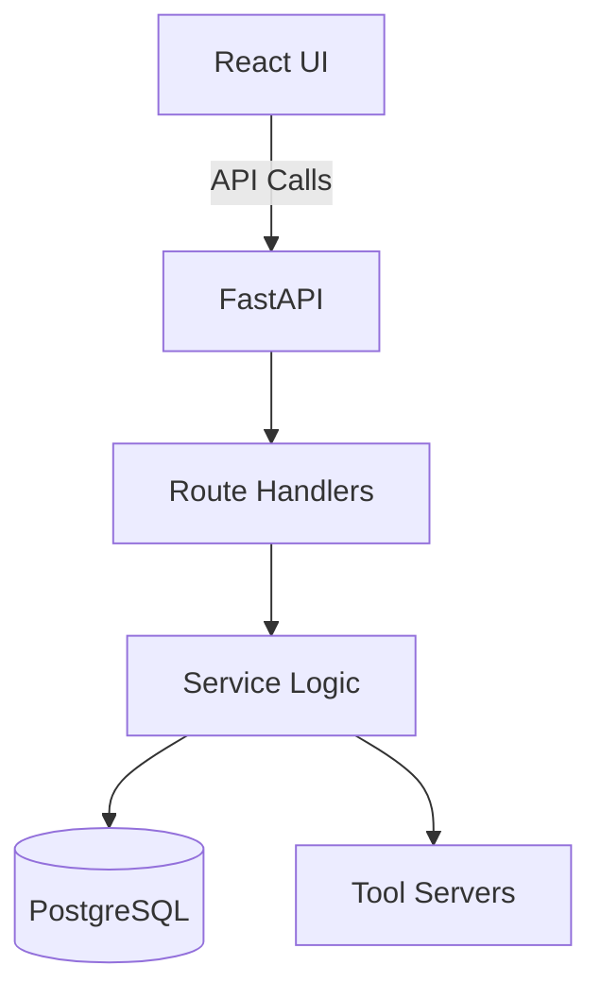
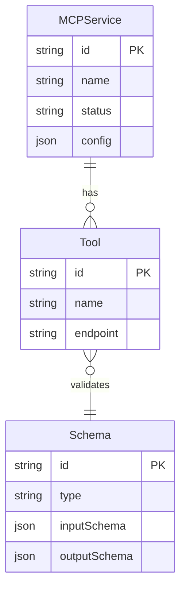
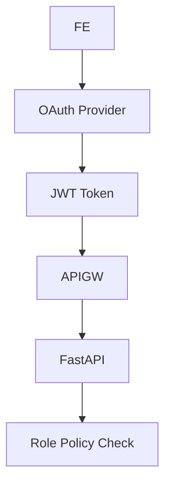
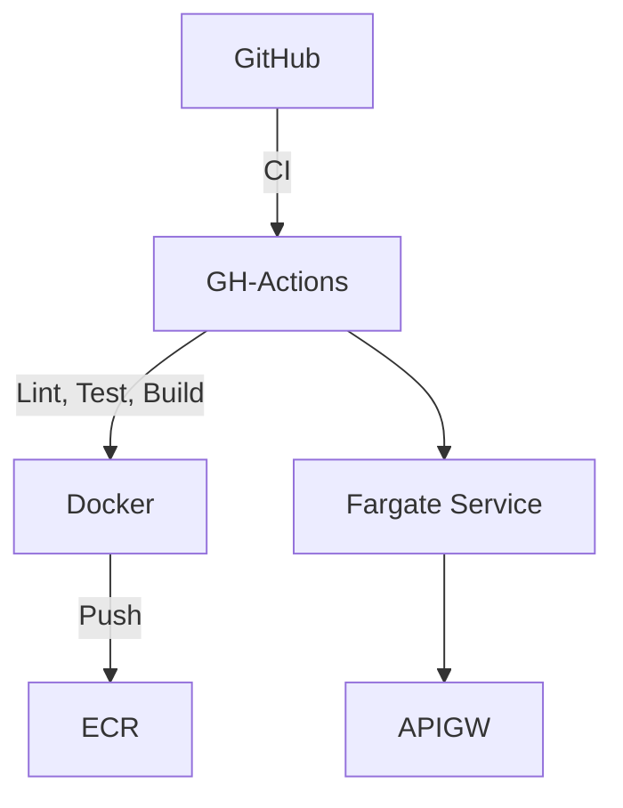
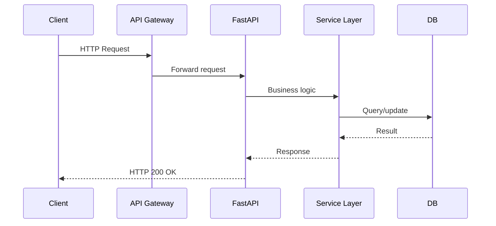

# 🏗️ Architecture: [Project Name]

**Status**: 🟠 DRAFT  
**Last Updated**: [Current updated dated in the format of YYYY-MM-DD (DO NOT makeup, just use bash command to get today date)]
**Author(s)**: [Name of User (if the user not provides their name, use their github username)]

---

## 📚 Technical Summary

- Microservice-based architecture for dynamic service registration and tool execution
- Built using React, FastAPI, PostgreSQL, and AWS infrastructure
- Dynamically generates OpenAPI endpoints based on external AI tools
- Designed for modular expansion and high performance under 500 RPS
- Supports flexible backend types (stdio, SSE, streamable HTTP)

---

## 🧰 Technology Stack

| Layer         | Technology         | Purpose              | Version/Notes            |
|---------------|--------------------|-----------------------|---------------------------|
| **Frontend**  | ReactJS            | Web UI                | Latest Stable             |
|               | TypeScript         | Type Safety           | v5.x                      |
| **Backend**   | Python             | Server Runtime        | 3.11+                     |
|               | FastAPI            | API Framework         | Async + typed             |
|               | Pydantic v2        | Data Validation       | Used for input/output     |
| **Database**  | PostgreSQL         | Relational DB         | v15.x on RDS              |
| **Infra**     | AWS API Gateway    | API Routing           | REST mode                 |
|               | AWS ECS/Fargate    | App Container Hosting | + ALB                     |
| **Monitoring**| CloudWatch         | Logs & Metrics        | Custom dashboards         |
| **CI/CD**     | GitHub Actions     | Build & Deployment    | Multi-stage workflows     |

---

## 🌐 High-Level System Architecture



---

## 🧩 Core Business Flow: Service Registration



---

## 🧱 Detailed Module Architecture



---

## 🗃️ Data Models



---

## 🔐 Security Architecture



* **Authentication**: OAuth2 with Auth0
* **Authorization**: Role-based via JWT claims
* **Token Expiry**: 15 minutes
* **Refresh Strategy**: Silent re-authentication on frontend

---

## 🚀 Deployment Architecture



### Environments

1. **Development** – Debugging enabled, feature flags on
2. **Staging** – Full-scale mock of production
3. **Production** – Scaled environment with monitoring, alerts

---

## 🔁 CI/CD Pipeline

* **CI Steps**

  * Lint → Typecheck → Unit Tests → Build Artifact
* **CD Steps**

  * Docker image pushed to ECR
  * Auto-deploy to ECS (dev/staging)
  * Manual promotion to production with rollback plan

---

## 📈 Monitoring & Observability

### Metrics to Track

* API error rates (4xx, 5xx)
* Response latency (p95)
* DB connection pool usage
* Task execution failures
* Tool connection success rate

### Alerts

* 5xx error rate > 2% (5 min window)
* DB pool usage > 90%
* Tool registration failures
* S3 upload failures

### Dashboards

* CloudWatch Dashboards: Latency, CPU, Memory, Errors
* Log Insights: JSON structured logs with request ID correlation

---

## 📐 Development Guidelines

### Folder Structure

```plaintext
/backend
  ├── routers/
  ├── services/
  ├── schemas/
  ├── models/
  └── utils/

/frontend
  ├── pages/
  ├── components/
  ├── hooks/
  └── lib/
```

---

### Request Lifecycle



---

## 🧪 Testing Strategy

### Frameworks

| Type        | Tool                    |
| ----------- | ----------------------- |
| Unit Tests  | `pytest`, `jest`        |
| Integration | `pytest`, `supertest`   |
| End-to-End  | `Playwright`, `Cypress` |

### Test Structure

```plaintext
/tests
  ├── unit/
  ├── integration/
  └── e2e/
```

### Testing Best Practices

1. **Unit Tests**

   * Cover service methods in isolation
   * No external DB or API calls

2. **Integration Tests**

   * Use in-memory DB (e.g. SQLite)
   * Assert API + DB interaction

3. **E2E Tests**

   * Simulate real user flows
   * Run against staging

---

## 📌 Appendix

* [OpenAPI Specification](#)
* [Confluence Design Doc](#)
* [Glossary of Terms](#)

```
